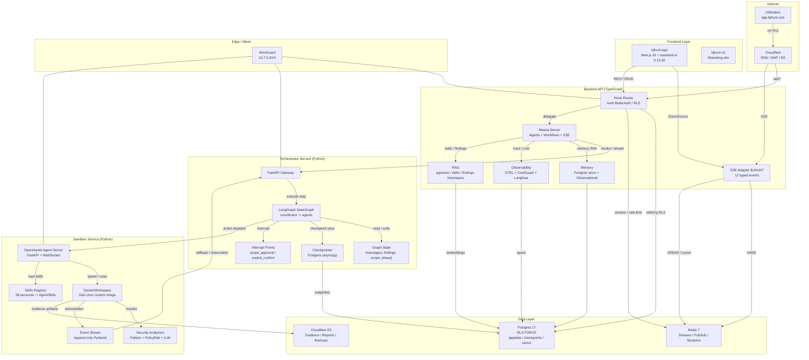
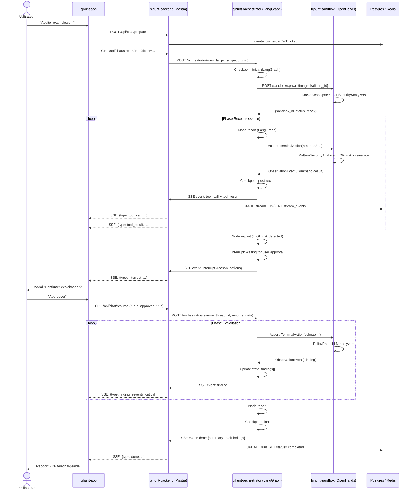

# DOCUMENT D'ARCHITECTURE CIBLE BJHUNT 4 MAX
**Theme : Migration hybride LangGraph + OpenHands + Mastra**
**Date : 2026-05-13**
**Statut : Draft — Revue architecte principal**

## 1. DIAGNOSTIC — Pourquoi changer ?

### 1.1 Faiblesses critiques de l'architecture actuelle

L'audit consolidé du 2026-05-12 et l'audit approfondi du 2026-05-01 ont mis au jour des failles structurelles qui ne peuvent pas etre corrigees par des patches incrementaux. Les quatre couches (template E2B, runtime openclaude fork, backend Hono, frontend assistant-ui) sont desormais des **contrats concurrents non synchronises**.

| ID | Faiblesse | Severite | Source |
|---|---|---|---|
| ARCH-01 | **Template E2B mutable, non versionne** : le template `bjhunt-kali` est reconstruit avec HEAD courant sans versioning d'artifact. Pas de provenance per-chat. | P0 | `build-e2b-template.sh:2`, `e2b.toml:18-19` |
| ARCH-02 | **Engine pas build dans la sandbox** : `dist/cli.mjs` est requis mais le Dockerfile ne copie que le source (pas `dist/`). Le processus moteur est mort au boot. | P0 | `bjhunt-kali.Dockerfile:85-90`, `bin/openclaude:6-7` |
| ARCH-03 | **Pas de single source of truth pour les lifecycle events** : `run.started` et `run.completed` sont emis en double (backend + relay). Le stream n'est pas une execution trace fiable. | P0 | `chats.ts:194/334`, `event-relay.cjs:249/362` |
| ARCH-04 | **Event model aspiratif** : 12 events types documentes, seulement 7 emis reellement. `agent.finding`, `agent.progress`, `agent.handoff`, `dream.diary_entry` n'existent que dans les prompts/docs. | P0-P1 | `STREAMING_EVENTS.md`, `event-relay.cjs:35-38` |
| ARCH-05 | **Sandbox bypass** : `--dangerously-skip-permissions` desactive le substrate sandbox natif d'OpenClaude. Les hooks `.cjs` sont incomplets (`FileWrite` vs `Write` obsolete). | P1 | `event-relay.cjs:156`, `scope-guard.cjs:150-151` |
| ARCH-06 | **Bridge state memoire uniquement** : pas de reattachment apres reboot backend. Chats `running` orphelins au restart. | P1 | `engine-bridge.ts:36` |
| ARCH-07 | **Settings/scope mutation incoherente** : env vs file vs inline, pas de mecanisme unifie de live update. | P1 | `run-engagement.sh`, `event-relay.cjs:530-574` |
| ARCH-08 | **Auth/data leaks** : tickets SSE JWT dans les logs, `/control` in-sandbox non authentifie, shape scope JSON erronee. | P0 | `index.ts:31`, `event-relay.cjs:442-472` |
| ARCH-09 | **Observabilite inexistante** : pas de tracing distribue, pas de monitoring cout LLM, pas de telemetry sur la chaine d'attaque. | P1 | N/A |
| ARCH-10 | **Memory long-term absente** : pas de contexte cross-chat, pas de compression automatique de l'historique. Chaque audit demarre a zero. | P1 | N/A |

**En resume** : le runtime actuel est un **empilement de glue code** (relay `.cjs`, hooks `.cjs`, bridge TS) qui simule un orchestrateur multi-agents mais qui, en realite, est un agent monolithique avec des sous-processus ad-hoc. Le frontend et la BD ont ete construits pour un systeme bien plus mature que ce que le relay sait produire.

---

### 1.2 Pourquoi LangGraph ?

LangGraph est un framework d'orchestration de graphes d'agents **stateful**. Il adresse directement quatre manquements critiques :

1. **Orchestration declarative** : le coordinator `BJHUNT -> Soundwave/Recon/Exploit/Reporter` est aujourd'hui code imperatif dans le fork openclaude (`LocalAgentTask` / `RemoteAgentTask` sans garde-fous). LangGraph permet de modeliser ce flux comme un `StateGraph` explicite avec transitions typees entre nodes.
2. **Checkpoints et reprise** : LangGraph propose un `Checkpointer` natif (Postgres/asyncpg) qui sauvegarde l'etat du graphe apres chaque step. Cela resout ARCH-06 (bridge state memoire) et ARCH-01 (provenance per-run).
3. **Human-in-the-loop natif** : les `interrupts` LangGraph permettent de suspendre le graphe a un node specifique (approbation scope, confirmation exploitation) et de le reprendre via un event externe. Cela remplace le mecanisme ad-hoc de `inject_message` du relay.
4. **Streaming structure** : LangGraph supporte 7 modes de streaming (values, updates, debug, messages, events, etc.) qui peuvent etre normalises dans les 12 events BJHUNT, resolvant ARCH-04.

> Pourquoi revenir sur une composante Python malgre ADR-003 (mono-langage TS) ?
> LangGraph JS (`langgraphjs`) existe mais est **moins riche et plus verbeux** que la version Python. L'orchestration multi-agents complexe (38 personas, HITL, checkpoints) est le coeur metier de BJHUNT. Il est justifie de faire une exception ciblee : **un service `bjhunt-orchestrator` en Python** qui expose une API REST/SSE, appele par le backend TS. Cela preserve le mono-langage TS pour 90 % de la codebase (backend + frontend) tout en utilisant le meilleur outil pour l'orchestration.

---

### 1.3 Pourquoi OpenHands ?

OpenHands (Software Agent SDK v1) est un framework d'**execution d'agents securise** avec sandboxing natif. Il adresse :

1. **Sandbox fiable** : `DockerWorkspace` avec isolation OS, reseau configurable, et support KVM (`SANDBOX_KVM_ENABLED`). Remplace le template E2B buggue qui ne builde pas l'engine (ARCH-02).
2. **Defense-in-depth** : `SecurityAnalyzer` embarque (Pattern, PolicyRail, LLM, Ensemble) evalue le risque avant execution d'une action. Remplace les hooks `.cjs` incomplets et obsoletes (ARCH-05).
3. **Event stream immuable** : `EventLog` append-only Pydantic-type. Toute action produit un `ActionEvent`, toute observation un `ObservationEvent`. Cela fournit la **single source of truth** manquante (ARCH-03).
4. **LLM agnostic via LiteLLM** : compatible avec le proxy LiteLLM deja en place chez BJHUNT.
5. **Skills memory** : les `AgentSkills` permettent de mapper les 38 personas BJHUNT sous forme de skills declenchables par keyword. C'est plus maintenable que les prompts inline actuels.

---

### 1.4 Pourquoi Mastra ?

Mastra est un framework TypeScript **"batteries included"** pour applications IA. Il adresse :

1. **Backend API type-safe** : serveur Hono auto-genere, routes REST `/api/agents/:id/stream`, OpenAPI natif. Remplace le backend Hono actuellement "thin layer" avec des routes ad-hoc.
2. **Workflows deterministes** : `createWorkflow` + `.then()/.parallel()/.branch()` permettent de modeliser des processus audits connus (ex. : generation OPPLAN -> approbation -> execution) avec `suspend()/resume()` pour le HITL.
3. **Memory composee** : `Memory` avec `ObservationalMemory` (compression automatique), `semantic recall` (vector search pgvector), et `working memory`. Resout ARCH-10.
4. **Observabilite integree** : OpenTelemetry natif, `CostGuardProcessor` pour le monitoring cout, et integration Langfuse/LangSmith. Resout ARCH-09.
5. **RAG integre** : pipeline documentaire complet pour indexer les skills d'audit, les findings historiques, et les catalogues de vulnerabilites.

---

## 2. MATRICE DE DECISION

| Composant BJHUNT | LangGraph | OpenHands | Mastra | Garder custom | Justification |
|---|---|---|---|---|---|
| **Orchestration multi-agents (coordinator → recon → scan → exploit → report)** | **X** |  |  |  | Graphe `StateGraph` Python avec checkpoints et interrupts natifs. Seul framework mature pour cette complexite. |
| **Sandbox code execution (nmap, python, bash)** |  | **X** |  |  | `DockerWorkspace` + `SecurityAnalyzer` + event stream immuable. Remplace E2B buggue. |
| **Streaming SSE vers frontend** |  |  | **X** | **X** | Mastra SSE natif via Vercel AI SDK + adapter custom pour les 12 events BJHUNT historiques. |
| **Persistance etat run (checkpoints, reprise)** | **X** |  | **X** |  | LangGraph `Checkpointer` pour l'etat graphe ; Mastra `Memory` + workflow `suspend/resume` pour le contexte conversationnel. |
| **Auth / RLS / tenancy** |  |  |  | **X** | BetterAuth + Drizzle RLS FORCE deja en place et dur a egaler. Mastra Auth (beta) en observation. |
| **API REST (chats, catalog, health)** |  |  | **X** | **X** | Mastra genere les routes agents/workflows, mais les routes metier legacy (catalog, billing) restent Hono custom dans un sous-routeur. |
| **Frontend Thread UI** |  |  |  | **X** | assistant-ui fork exact `0.10.50` avec adapter SSE `ExternalStoreRuntime`. Migration couteuse et non critique. |
| **Observability (tracing, couts)** |  |  | **X** |  | OpenTelemetry natif, `CostGuardProcessor`, integration Langfuse. |
| **Memory long-term (contexte cross-chat)** |  |  | **X** |  | `ObservationalMemory` + `semantic recall` pgvector. |
| **Human-in-the-loop (approbation scope/exploit)** | **X** | **X** | **X** |  | Triptyque : LangGraph `interrupt` (graphe) + Mastra `suspend/resume` (workflow backend) + OpenHands `ConfirmRisky` (sandbox). |
| **Rapports / Canvas / Typst** |  |  |  | **X** | 14 templates Typst existants + pipeline custom. Pas de valeur a les migrer. |

---

## 3. ARCHITECTURE CIBLE — HYBRIDE

### 3.1 Principes directeurs

1. **LangGraph** est le **cerveau** : il decide quoi faire, dans quel ordre, et ou s'arreter.
2. **OpenHands** est le **muscle** : il execute les commandes de maniere isolee et securisee.
3. **Mastra** est le **systeme nerveux** : il expose l'API, gere la memoire, trace tout, et stream vers le client.
4. **Frontiere langage** : service `bjhunt-orchestrator` (Python) <-> `bjhunt-backend` (TS) via HTTP/SSE contrat. Le frontend et le backend restent TS (mono-langage preserve a 90 %).

### 3.2 Decoupage des services

| Service | Langage / Stack | Role | Remplace |
|---|---|---|---|
| `bjhunt-app` | TS / Next.js 16 + assistant-ui | Dashboard utilisateur | Inchangé (adapter SSE uniquement) |
| `bjhunt-backend` | TS / Bun + Hono + Mastra | Auth, REST, SSE, Memory, Observability, RAG | Backend Hono custom actuel |
| `bjhunt-orchestrator` | Python / LangGraph + FastAPI | Graphe coordinator, checkpoints, HITL interrupts | Fork openclaude runtime |
| `bjhunt-sandbox` | Python / OpenHands SDK | DockerWorkspace, execution outils, security analysis | E2B template + relay + hooks |
| `bjhunt-postgres` | Postgres 17 | Donnees app, checkpoints LangGraph, memory Mastra, vector | Postgres actuel |
| `bjhunt-redis` | Redis 7 | Cache, rate limit, pubsub cancel | Redis actuel |

### 3.3 Diagramme d'architecture cible (Mermaid)

### 3.4 Flux d'un audit complet (Happy Path)

---

## 4. PLAN DE MIGRATION EN PHASES

### Phase 0 : Preparation (Semaine 0)

**Objectif** : Isoler les environnements, ecrire les tests de regression, et preparer les variables d'environnement.

| Livrable | Detail |
|---|---|
| **Branches git** | `feat/mastra-backend` (depuis `main`), `feat/langgraph-poc` (depuis `main`), `feat/openhands-adapter`, `feat/frontend-sse-v2`. Aucun merge sur `main` avant critere Phase 1. |
| **Tests pre-migration** | 1. Test E2E streaming existant (`tests/e2e/stream-lifecycle.spec.ts`) : verifier reconnect + replay.  2. Test contract scope-guard (`tests/unit/scope-guard.spec.ts`) : valider shape correcte.  3. Test sandbox smoke (`tests/e2e/e2b-smoke.spec.ts`) : valider que le template actuel build (baseline).  4. Test bridge reconnect (`tests/e2e/bridge-reconnect.spec.ts`) : forcer `SIGUSR2` et redispatch. |
| **Env vars a ajouter** | `MASTRA_STORAGE_URL=postgres://...`  `LANGGRAPH_API_URL=http://bjhunt-orchestrator:8000`  `OPENHANDS_API_URL=http://bjhunt-sandbox:8000`  `OTEL_EXPORTER_OTLP_ENDPOINT=http://...`  `MASTRA_COSTGUARD_MAX_AUDIT_USD=5.0`  `BJHUNT_SANDBOX_IMAGE=bjhunt/kali-sandbox:v1.0.0`  `BJHUNT_DISABLE_LEGACY_ENGINE=true` (feature flag) |

**Risques** : Aucun code de production modifie. Rollback : `git checkout main`.

---

### Phase 1 : Mastra Backend (Semaines 1-2)

**Objectif** : Integrer Mastra dans `bjhunt-backend` sans casser les routes existantes. Le backend Hono actuel devient un **sous-routeur** legacy sous Mastra.

| Action | Fichiers concernes |
|---|---|
| 1. Initialiser Mastra | `src/mastra/index.ts` (config principale) |
| 2. Definir l'agent supervisor BJHUNT | `src/mastra/agents/bjhunt-supervisor.ts` |
| 3. Definir le workflow audit OPPLAN | `src/mastra/workflows/audit-plan.ts` |
| 4. Configurer Memory | `src/mastra/memory/index.ts` |
| 5. Configurer Observability | `src/mastra/observability/index.ts` |
| 6. Adapter Hono | `src/server.ts` (monter MastraServer + legacy router) |
| 7. Wrapper endpoints chat | `src/chat/proxy-to-mastra.ts` (interception conditionnelle) |

**Risques identifies** :
- Collision entre routes auto-generees Mastra (`/api/agents/:agentId/stream`) et routes legacy (`/api/chat/stream/:runId`).
- Regression auth BetterAuth (Mastra ne connait pas la session BJHUNT).

**Criteres de succes** :
- `/api/health` retourne OK avec db + redis + mastra status.
- Auth BetterAuth intacts (login, session, 2FA).
- Studio Mastra accessible sur `http://localhost:4111` avec l'agent supervisor visible.

---

### Phase 2 : LangGraph Coordinator (Semaines 3-4)

**Objectif** : Remplacer le runtime openclaude fork par un service Python LangGraph.

| Action | Fichiers concernes |
|---|---|
| 1. Structurer le service | `orchestrator/main.py` (FastAPI), `orchestrator/state.py` (TypedDict etat) |
| 2. Definir le graphe | `orchestrator/graph.py` (StateGraph coordinator) |
| 3. Implementer les nodes | `orchestrator/nodes/coordinator.py`, `nodes/recon.py`, `nodes/scan.py`, `nodes/exploit.py`, `nodes/report.py` |
| 4. Configurer checkpointer | `orchestrator/checkpointer.py` (PostgresSaver) |
| 5. Definir les interrupts | `orchestrator/interrupts.py` (scope_approval, exploit_confirm) |
| 6. Exposer API REST | `orchestrator/routers/runs.py` (creer run, stream events, resume interrupt) |
| 7. Dockerfile | `orchestrator/Dockerfile` |

**Criteres de succes** :
- Le graphe execute `recon -> scan -> report` en moins de 90 secondes sur target `scanme.nmap.org`.
- Les checkpoints permettent de `resume` un run interrompu au milieu de la phase recon.
- Les interrupts bloquent correctement avant exploitation HIGH et attendent l'approbation utilisateur.

---

### Phase 3 : OpenHands Sandbox (Semaines 5-6)

**Objectif** : Remplacer le template E2B + relay event + hooks `.cjs` par OpenHands Runtime.

| Action | Fichiers concernes |
|---|---|
| 1. Configurer OpenHands | `sandbox/config.py` (env vars, LLM LiteLLM) |
| 2. Creer Dockerfile Kali | `sandbox/Dockerfile.kali` (base Kali + outils pentest + user non-root) |
| 3. Mapper les outils | `sandbox/tools/pentest_tools.py` (nmap, sqlmap, nuclei, etc. comme custom tools) |
| 4. Configurer security | `sandbox/security/analyzers.py` (Pattern + PolicyRail + LLM ensemble) |
| 5. Adapter l'execution | `sandbox/execution_adapter.py` (recoit ActionEvent, retourne ObservationEvent) |
| 6. Exposer API | `sandbox/main.py` (FastAPI agent-server) |
| 7. Dockerfile service | `sandbox/Dockerfile` |
| 8. Mise a jour backend | `src/lib/openhands-client.ts` (remplace `e2b.ts` et `engine-bridge.ts`) |

**Criteres de succes** :
- `nmap -sS` retourne un `CommandResult` structure avec stdout/stderr/exit_code.
- Une commande `rm -rf /` est bloquee par `PatternSecurityAnalyzer` avec risque CRITICAL.
- Les events sont append-only dans l'EventLog et restituables.

---

### Phase 4 : Frontend Integration (Semaines 7-8)

**Objectif** : Brancher le frontend sur le nouveau SSE Mastra/LangGraph tout en gardant assistant-ui `0.10.50`.

| Action | Fichiers concernes |
|---|---|
| 1. Creer adapter Mastra | `lib/mastra-runtime.ts` (nouveau) |
| 2. Creer hook de stream | `hooks/use-mastra-stream.ts` (nouveau) |
| 3. Mapper les 12 events | `lib/bjhunt-event-mapper.ts` (traduit events Mastra/LangGraph vers UI assistant-ui) |
| 4. Conserver fallback | `hooks/use-engagement-stream.ts` (renomme legacy, appel conditionnel) |
| 5. Adapter le thread | `components/chat/audit-timeline-panel.tsx` (utiliser nouveau mapper) |

**Criteres de succes** :
- Le streaming fonctionne avec reconnect auto (`Last-Event-ID`).
- Les 12 events BJHUNT (`tool_call`, `finding`, `interrupt`, etc.) s'affichent correctement dans l'UI.

---

### Phase 5 : Observability & Polish (Semaines 9-10)

**Objectif** : Tracing end-to-end, monitoring cout, tests E2E.

| Action | Fichiers concernes |
|---|---|
| 1. Configurer OTEL | `mastra/observability.ts` |
| 2. Ajouter CostGuard | `mastra/agents/bjhunt-supervisor.ts` (inputProcessors) |
| 3. Ajouter attributs custom | Span attributes `bjhunt.org_id`, `bjhunt.run_id`, `llm.cost_usd` |
| 4. Integration Langfuse | `docker-compose.yml` + env vars `LANGFUSE_PUBLIC_KEY` |
| 5. Tests E2E audit complet | `tests/e2e/audit-lifecycle.spec.ts` |
| 6. Documentation contrats | `docs/INTERFACE_CONTRACTS.md` |

**Criteres de succes** :
- Une trace complete d'un audit est visible dans Langfuse (du POST `/prepare` au `done`).
- Le cout LLM par audit est trace avec une precision < $0.01.
- La suite E2E `audit-lifecycle` est verte (recon + interrupt + exploit + report).
- Temps-to-first-token < 2s p95.
- Cout par audit < $0.30.

---

## 6. PREMIER FICHIER A IMPLEMENTER

### Fichier : `apps/backend/src/mastra/index.ts`

Voir le code complet dans le livrable — ce fichier initialise Mastra avec :
- 1 agent supervisor (BJHUNT Coordinator)
- 1 workflow d'audit deterministe (OPPLAN -> Recon -> Scan -> Report)
- Memory composite Postgres + libSQL
- Observability OpenTelemetry + CostGuard
- 1 tool adapter OpenHands (sandbox execution)

**Comment demarrer** :
1. `bun add @mastra/core @mastra/memory @mastra/observability zod`
2. `npx mastra dev` (Studio sur http://localhost:4111)
3. Tester le workflow manuellement sans frontend.
